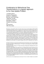
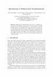

# Bidirectional Transformations

<a href="https://doi.org/10.1145/1232420.1232424"></img></a>
<pre>
2007 e6de477 65p
  <b><i>Combinators for bidirectional tree transformations</i></b>
  A linguistic approach to the view-update problem
    J. N. Foster, M. B. Greenwald, J. T. Moore,
    B. C. Pierce, A. Schmitt
</pre>

<a href="https://doi.org/10.1007/978-3-319-79108-1_1"></img></a>
<pre>
2018 221c7db 29p
  <b><i>Introduction to Bidirectional Transformations</i></b>
    Faris Abou-Saleh, James Cheney, Jeremy Gibbons,
    James McKinna, Perdita Stevens

</pre>
