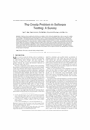
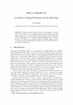

# Software Testing

<a href="https://doi.org/10.1093/comjnl/25.4.465"></img></a>
<pre>
1982 3994c79 6p
  <b><i>On Testing Non-Testable Programs</i></b>
    Elaine J. Weyuker

</pre>

<a href="https://doi.org/10.48550/arXiv.2002.12543"></img></a>
<pre>
1998 4578871 11p
  <b><i>Metamorphic Testing</i></b>
  A New Approach for Generating Next Test Cases
    T.Y. Chen, S.C. Cheung, S.M. Yiu

</pre>

<a href="https://doi.org/10.1109/TSE.2014.2372785"></img></a>
<pre>
2015 64b1960 19p
  <b><i>The Oracle Problem in Software Testing</i></b>
  A Survey
    Earl T. Barr, Mark Harman, Phil McMinn

</pre>

<a href="http://doi.org/10.1007/978-3-030-47147-7_4"></img></a>
<pre>
2020 9d25c81 25p
  <b><i>How to Specify It!</i></b>
  A Guide to Writing Properties of Pure Functions
    John Hughes

</pre>
