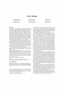
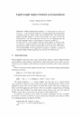

# Type Theory

<a href="https://doi.org/10.1145/1708016.1708028"></img></a>
<pre>
2010 40dba0d 13p
  <b><i>F-ing modules</i></b>
    Andreas Rossberg, Claudio V. Russo, Derek Dreyer

</pre>

<a href="https://doi.org/10.1007/978-3-319-07151-0_8"></img></a>
<pre>
2014 aa2f160 17p
  <b><i>Lightweight Higher-Kinded Polymorphism</i></b>
    Jeremy Yallop 
    Leo White

</pre>
